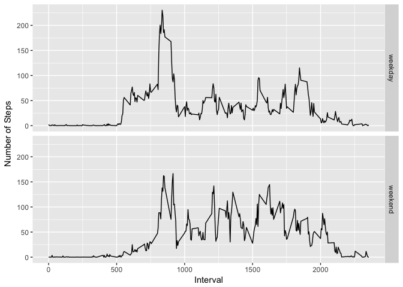

# Reproducible Research: Peer Assessment 1
###Submission by : Shanthan Kesharaju


It is now possible to collect a large amount of data about personal movement using activity monitoring devices such as a Fitbit, Nike Fuelband, or Jawbone Up. These type of devices are part of the “quantified self” movement – a group of enthusiasts who take measurements about themselves regularly to improve their health, to find patterns in their behavior, or because they are tech geeks. But these data remain under-utilized both because the raw data are hard to obtain and there is a lack of statistical methods and software for processing and interpreting the data.

This assignment makes use of data from a personal activity monitoring device. This device collects data at 5 minute intervals through out the day. The data consists of two months of data from an anonymous individual collected during the months of October and November, 2012 and include the number of steps taken in 5 minute intervals each day.

## Loading and preprocessing the data


```r
activity <- read.csv("~/Developer/R/Coursera/Reproducible Research/Week 2/activity.csv")
activityDf <- activity[!is.na(activity$steps),]
activityDf <- droplevels(activityDf)
```

The dataset has three columns: steps, date and interval. Upon observing summary of the dataset, the steps column happened to having missing values. A new dataset was created without the missing values and was used for the below analysis.

## What is mean total number of steps taken per day?

The total number of steps per day was calculated and the frequencies were plotted in a histogram.

```r
dailysteps <- tapply(activityDf$steps,activityDf$date,sum)
dailystepsDf <- data.frame(date = names(dailysteps), steps=dailysteps)
m <- ggplot(dailystepsDf, aes(x=steps))
m + geom_histogram(bins=20) + scale_y_continuous(breaks= pretty_breaks()) + xlab("Number of Steps") + ylab("Frequency")
```

<!-- -->

The mean and median number of steps taken per day.

```r
mean(dailystepsDf$steps)
```

```
## [1] 10766.19
```

```r
median(dailystepsDf$steps)
```

```
## [1] 10765
```
## What is the average daily activity pattern?
In order to undertsand the average daily acitivty pattern, the mean number of stpes taken in the each five minute interval on all the recorded days was calculated and a time series plot was generated.

```r
stepsInTimeInterval <- tapply(activityDf$steps,activityDf$interval,mean)
stepsInTimeIntervalDf <- data.frame(timeInterval = as.numeric(names(stepsInTimeInterval)), steps=stepsInTimeInterval)
m <- ggplot(stepsInTimeIntervalDf, aes(timeInterval, steps)) 

m + geom_line() + theme(axis.text.x=element_text(angle = -90), legend.position="none") + geom_text(data = stepsInTimeIntervalDf[stepsInTimeIntervalDf$steps == max(stepsInTimeIntervalDf$steps),],aes(timeInterval,steps, label =paste("Max { timeInterval=", timeInterval,", steps=", round(steps,digits=2),"}")), nudge_y =10)+ xlab("Interval") + ylab("Number of Steps")
```

<!-- -->

## Imputing missing values
An analysis showed that the datset has 2304 rows with missing values.

```r
rowsWithMissingValuesDf <- activity[rowSums(is.na(activity)) > 0,]
rowsWithoutMissingValuesDf <- activity[!rowSums(is.na(activity)) > 0,]
nrow(rowsWithMissingValuesDf)
```

```
## [1] 2304
```

The missing values from the initial dataset were filled in with the mean number of steps of that particular five minute interval.

```r
for(i in 1:nrow(rowsWithMissingValuesDf))
{
  rowsWithMissingValuesDf[i,1]<- stepsInTimeIntervalDf[stepsInTimeIntervalDf$timeInterval==rowsWithMissingValuesDf[i,3],2]
}
activityWithoutMissingValuesDf <- merge(rowsWithMissingValuesDf,rowsWithoutMissingValuesDf, all=TRUE)
```

## Are there differences in activity patterns between weekdays and weekends?

A study was done to compare the patterns of the activity over weekdays and weekends. Time Series plots for weekdays and weekends were generated.


```r
activityWithoutMissingValuesDf$date <- as.POSIXct(activityWithoutMissingValuesDf$date)
weekdayActivityDf <- activityWithoutMissingValuesDf[ !(weekdays(activityWithoutMissingValuesDf$date) %in% c("Saturday","Sunday")), ]
weekendActivtyDf <-  activityWithoutMissingValuesDf[ (weekdays(activityWithoutMissingValuesDf$date) %in% c("Saturday","Sunday")), ]

stepsInTimeIntervalOnWeekdays <- tapply(weekdayActivityDf$steps,weekdayActivityDf$interval,mean)
stepsInTimeIntervalOnWeekdaysDf <- data.frame(timeInterval = as.numeric(names(stepsInTimeIntervalOnWeekdays)), steps=stepsInTimeIntervalOnWeekdays, weekday="weekday")

stepsInTimeIntervalOnWeekends <- tapply(weekendActivtyDf$steps,weekendActivtyDf$interval,mean)
stepsInTimeIntervalOnWeekendsDf <- data.frame(timeInterval = as.numeric(names(stepsInTimeIntervalOnWeekends)), steps=stepsInTimeIntervalOnWeekends, weekday="weekend")

stepsInTimeIntervalWithoutMissingValuesDf <- merge(stepsInTimeIntervalOnWeekdaysDf, stepsInTimeIntervalOnWeekendsDf, all=TRUE)

m <- ggplot(stepsInTimeIntervalWithoutMissingValuesDf, aes(timeInterval, steps)) 

m + geom_line() + facet_grid(weekday ~ .) + xlab("Interval") + ylab("Number of Steps")
```

<!-- -->

The study revealed two notable findings:

. The activty during the day time over the weekends is generally higher than the activity over the weekdays. This is a logical conclusion, assuming the person    has a job which requires him to be sedentary most of the time. Over the weekends, people tend to be more active doing household work, working outdoors or         traveling which are walking intensive.

. The activity between 8 AM and 9 AM seems to be higher during the weekdays, and it again seems logical assuming at least some portion of his morning commute to  work includes walking. Over the weekends, this is naturally lower given he doesnt have to commute.
