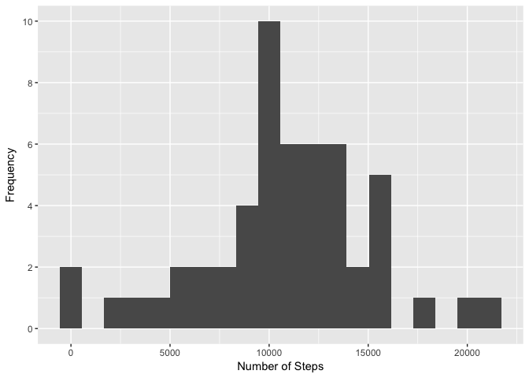
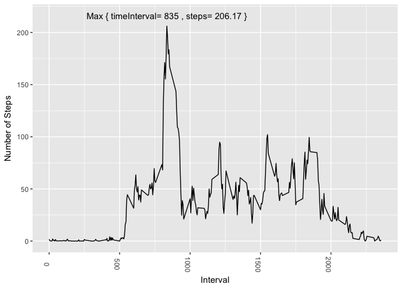
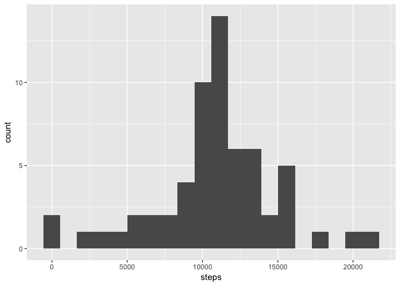

# Reproducible Research: Peer Assessment 1


## Loading and preprocessing the data


```r
activity <- read.csv("~/Developer/R/Coursera/Reproducible Research/Week 2/activity.csv")
activitydf <- activity[!is.na(activity$steps),]
activitydf <- droplevels(activitydf)
```


## What is mean total number of steps taken per day?

```r
dailysteps <- tapply(activitydf$steps,activitydf$date,sum)
dailysteps_df <- data.frame(date = names(dailysteps), steps=dailysteps)
m <- ggplot(dailysteps_df, aes(x=steps))
m + geom_histogram(bins=20) + scale_y_continuous(breaks= pretty_breaks()) + xlab("Number of Steps") + ylab("Frequency")
```

<!-- -->


```r
mean(dailysteps_df$steps)
```

```
## [1] 10766.19
```

```r
median(dailysteps_df$steps)
```

```
## [1] 10765
```
## What is the average daily activity pattern?


```r
stepsInTimeInterval <- tapply(activitydf$steps,activitydf$interval,mean)
stepsInTimeIntervaldf <- data.frame(timeInterval = as.numeric(names(stepsInTimeInterval)), steps=stepsInTimeInterval)
m <- ggplot(stepsInTimeIntervaldf, aes(timeInterval, steps)) 

m + geom_line() + theme(axis.text.x=element_text(angle = -90), legend.position="none") + geom_text(data = stepsInTimeIntervaldf[stepsInTimeIntervaldf$steps == max(stepsInTimeIntervaldf$steps),],
            aes(timeInterval,steps, label =paste("Max { timeInterval=", timeInterval,", steps=", round(steps,digits=2),"}")), nudge_y =10)
```

<!-- -->

## Imputing missing values


```r
rowsWithMissingValuesDF <- activity[rowSums(is.na(activity)) > 0,]
rowsWithoutMissingValuesDF <- activity[!rowSums(is.na(activity)) > 0,]
nrow(rowsWithMissingValuesDF)
```

```
## [1] 2304
```

```r
  for(i in 1:nrow(rowsWithMissingValuesDF))
  {
     rowsWithMissingValuesDF[i,1]<- stepsInTimeIntervaldf[stepsInTimeIntervaldf$timeInterval==rowsWithMissingValuesDF[i,3],2]
  }
 activityWithoutMissingValuesDf <- merge(rowsWithMissingValuesDF,rowsWithoutMissingValuesDF, all=TRUE)
```

## Are there differences in activity patterns between weekdays and weekends?


```r
activityWithoutMissingValuesDf$date <- as.POSIXct(activityWithoutMissingValuesDf$date)
 weekdayActivityDf <- activityWithoutMissingValuesDf[ !(weekdays(activityWithoutMissingValuesDf$date) %in% c("Saturday","Sunday")), ]
 weekendActivtyDf <-  activityWithoutMissingValuesDf[ (weekdays(activityWithoutMissingValuesDf$date) %in% c("Saturday","Sunday")), ]
 
 stepsInTimeIntervalOnWeekdays <- tapply(weekdayActivityDf$steps,weekdayActivityDf$interval,mean)
 stepsInTimeIntervalOnWeekdaysDf <- data.frame(timeInterval = as.numeric(names(stepsInTimeIntervalOnWeekdays)), steps=stepsInTimeIntervalOnWeekdays, weekday="weekday")
 
 stepsInTimeIntervalOnWeekends <- tapply(weekendActivtyDf$steps,weekendActivtyDf$interval,mean)
 stepsInTimeIntervalOnWeekendsDf <- data.frame(timeInterval = as.numeric(names(stepsInTimeIntervalOnWeekends)), steps=stepsInTimeIntervalOnWeekends, weekday="weekend")
 
 stepsInTimeIntervalWithoutMissingValuesDf <- merge(stepsInTimeIntervalOnWeekdaysDf, stepsInTimeIntervalOnWeekendsDf, all=TRUE)
 
 m <- ggplot(stepsInTimeIntervalWithoutMissingValuesDf, aes(timeInterval, steps)) 
 
 m + geom_line() + facet_grid(weekday ~ .) + xlab("Interval") + ylab("Number of Steps")
```

<!-- -->
